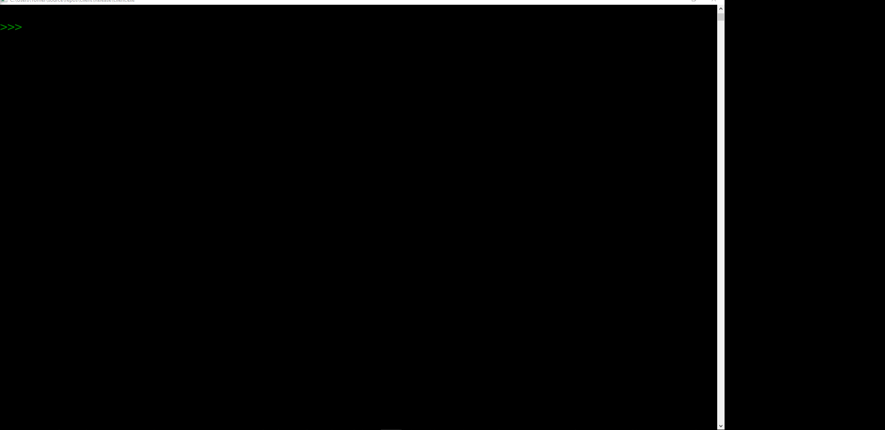
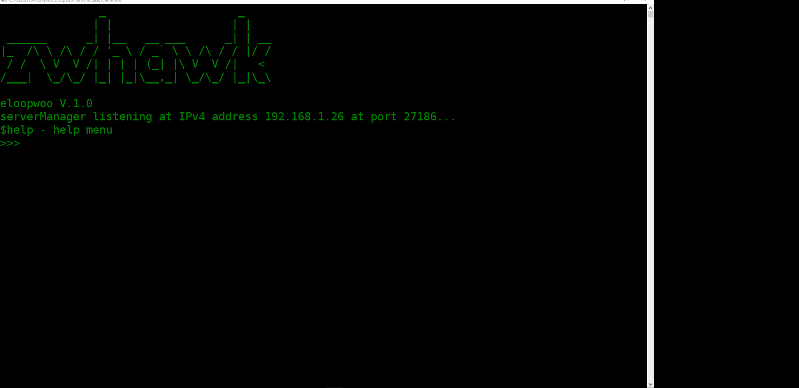
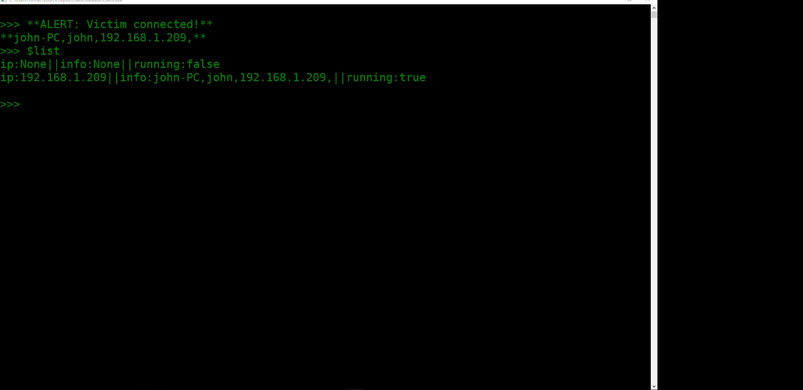
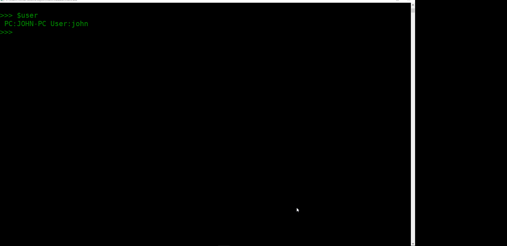
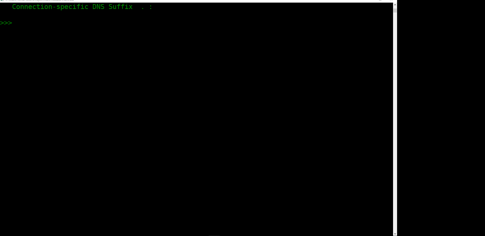
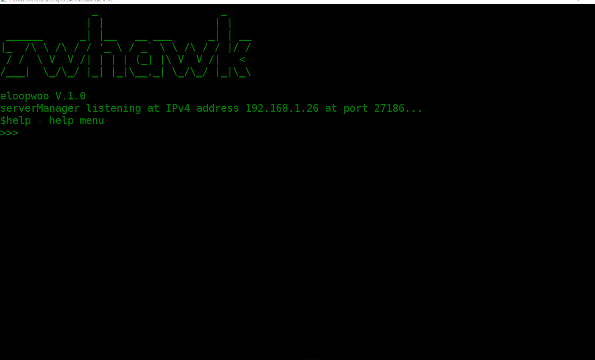

# ZwHawk

A kernel rootkit with remote command and control interface for windows









### Synopsis

The project is set of tools that help to achive remote control on compromised machines
while staying undetectable, stealthy and persistent.

### Motivation

For the courios that want to take a journey into: Intel X86, WinodowsNT, 
PE Executables, WinAPI, NativeAPI and Windows Kernel Drivers

## Getting Started

Dropper, Client and Rootkit are compiled separately. 

### Prerequisities

What things you need

```
Windows 10 (Main Working Station - Development)
Visual Studio 2017 Community (Platform Toolset - Visual Studio 2015 - Windows XP (v140_xp))
Visual Studio 2008 Pro (SDK & DDK & WDK 7.1.0 (7600.16385.1))
Sysinternals Suite
WinDBG
IDA-Pro
Oracle VM VirtualBox
Windows 7 SP1 (VM | Physical)
Windows XP SP3 (VM | Physical)
```

### Installing

A step by step series of examples that tell you have to get a development env running

Download VS 2017 Community + VS 2008 Pro

```
https://www.visualstudio.com/downloads/
http://download.microsoft.com/download/8/1/d/81d3f35e-fa03-485b-953b-ff952e402520/VS2008ProEdition90dayTrialENUX1435622.iso
```

Download DDK + WDK 7.1.0
```
http://visualddk.sysprogs.org/download/
https://www.microsoft.com/en-us/download/details.aspx?id=11800
```

Download Sysinternals Suite + WinDbg
```
https://docs.microsoft.com/en-us/sysinternals/downloads/sysinternals-suite
https://developer.microsoft.com/en-us/windows/hardware/download-windbg
```

Download Oracle VM VirtualBox + iso + IDA-Pro
```
https://www.virtualbox.org/wiki/Downloads
http://windowsiso.net/
https://www.hex-rays.com/products/ida/support/download.shtml
```

## Example Use

The project is currently splitted to three main components:

Client - The tool used by the intruder, class Parser to parse user input to requested operations,
class Manual help the user to use the tool, class Server to manage victims information and handle 
a "ping" from every victim to check is alive and class Client generates and send request to specified victim.

Dropper - The executable that runs in the victim machine, the dropper stores inside it the payload (kernel rootkit)
and handle the loading procedures. class ClientHandler responsible to register the machine in the intruder server
and send "ping" request as long as it runs, class DriverHandler take take of communication between user mode and
kernel mode (rootkit), class RatHandler is responsible of receiving requests from the intruder and executing them,
class RegistryHandler is responsible to set keys in the registry, class ResourceHandler take take of encapsulating 
and decapsulating resources (rootkit), class ServicesHandler is responsible to communicate with scm and
register and load the kernel driver (rootkit).

Rootkit - Handle the responsiblity of stealth by hooking and directly changing objects in the kernel.

Also there is config.json for the Dropper, specified the intruder server ip, name of the dropper file and 
name of the kernel driver.


## Authors

* **Tomer Eyzenberg** - *Initial work* - [eLoopWoo](https://github.com/eLoopWoo)
